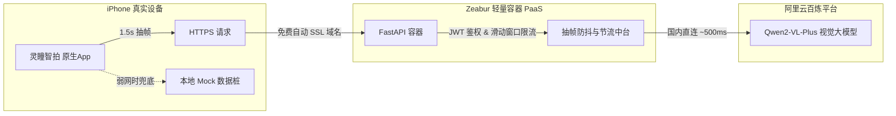

# AestheticLens-AI (灵瞳智拍) —— 实机演示与极简部署上线指南 (选项 A)

| 文档版本 | v2.0.0 | 适用方案 | 选项 A：Zeabur 容器托管 + 阿里云 Qwen-VL + 个人真机直装 |
| :--- | :--- | :--- | :--- |
| **所属分类** | 技术架构 / 部署实操 | 核心优势 | **0 服务器投入、免备案 HTTPS、防翻车双保险、出门只带手机即可演示** |
| **目标受众** | 个人开发者、答辩演示者、现场技术汇报人 | 预估预算 | **总计约 10~15 元人民币** (可支持上千次实操演示) |

---

## 目录
1. [方案 A 全貌拓扑与预算清单](#1-方案-a-全貌拓扑与预算清单)
2. [步骤一：阿里云百炼 (Qwen-VL-Plus) 密钥获取与额度充值](#2-步骤一阿里云百炼-qwen-vl-plus-密钥获取与额度充值)
3. [步骤二：云端微服务在 Zeabur 的全自动容器化部署](#3-步骤二云端微服务在-zeabur-的全自动容器化部署)
4. [步骤三：iPhone 客户端免费证书真机部署与 AltStore 无线续期](#4-步骤三iphone-客户端免费证书真机部署与-altstore-无线续期)
5. [步骤四：现场演示“防翻车”双保险实操配置 (Debug 菜单)](#5-步骤四现场演示防翻车双保险实操配置-debug-菜单)
6. [步骤五：全链路连通性自检 Checklist](#6-步骤五全链路连通性自检-checklist)

---

## 1. 方案 A 全貌拓扑与预算清单

针对“个人自用 + 对外随时实机演示（无需背笔记本电脑）”的特定诉求，整体部署链路如下：



### 💰 启动预算明细表
* **Apple 开发者账号**：**0 元**（使用个人免费 Apple ID 签名）；
* **云端服务器/宿主机**：**0 元**（无须购买 ECS/CVM）；
* **Zeabur 托管平台**：**约 2 ~ 5 元 / 月**（按实际运行内存计费，无请求时不占高负荷，新注册用户赠送初始额度）；
* **Qwen-VL-Plus 算力池**：**充值 10 元**（单次调用约 0.008~0.01 元，可支撑 1000+ 次真实构图与调色演示）；
* **首期总启动投入**：**约 10 ~ 15 元**，一杯奶茶钱即可完成工业级全链路交付！

---

## 2. 步骤一：阿里云百炼 (Qwen-VL-Plus) 密钥获取与额度充值

1. **登录控制台**：
   * 浏览器访问 [阿里云百炼平台 (DashScope)](https://bailian.console.aliyun.com/)，使用阿里云账号或支付宝扫码登录。
2. **开通模型服务**：
   * 在左侧菜单进入“模型广场”，找到 `qwen-vl-plus`（通义千问视觉大模型强化版），点击“开通服务”。新用户通常享有数万到数十万免费 Token 体验包。
3. **充值防熔断**：
   * 在“费用中心”账户余额中充值 **10 元** 作为安全兜底金，确保演示期间接口调用不因欠费被截断。
4. **获取 API-KEY**：
   * 进入右上角“API-KEY 管理”，点击“创建新的 API-KEY”。
   * 将生成的密钥妥善保存（形如：`sk-89a7b6c5d4e3f2...`），该密钥将在下一步配置到 Zeabur 环境变量中。

---

## 3. 步骤二：云端微服务在 Zeabur 的全自动容器化部署

Zeabur 是现代开发者极佳的 Serverless/PaaS 平台，能直接读取 GitHub 仓库并自动构建 Docker 镜像，同时提供免费公网 HTTPS。

### 3.1 准备服务镜像构建清单
确保代码仓库 `server/` 目录下具备以下文件：

**1) `code/Dockerfile`**：
```dockerfile
FROM python:3.11-slim

WORKDIR /app

# 设置时区与环境变量
ENV PYTHONDONTWRITEBYTECODE=1 \
    PYTHONUNBUFFERED=1 \
    TZ=Asia/Shanghai

# 安装基础依赖
COPY requirements.txt .
RUN pip install --no-cache-dir -r requirements.txt -i https://pypi.tuna.tsinghua.edu.cn/simple

# 复制代码
COPY . .

# 暴露端口并启动
EXPOSE 8000
CMD ["uvicorn", "app.main:app", "--host", "0.0.0.0", "--port", "8000"]
```

**2) `code/requirements.txt`**：
```text
fastapi>=0.110.0
uvicorn[standard]>=0.28.0
pydantic>=2.6.0
python-multipart>=0.0.9
httpx>=0.27.0
PyJWT>=2.8.0
pillow>=10.2.0
dashscope>=1.14.0
```

### 3.2 在 Zeabur 上线发布
1. **注册与绑定**：
   * 打开 [Zeabur 官网](https://zeabur.com/)，点击 “Get Started”，使用你的 GitHub 账号直接登录。
2. **创建项目 (Create Project)**：
   * 点击 “Create Project”，区域选择“Asia-East（中国香港或东京）”，获得低网络往返延迟。
3. **导入 Git 仓库**：
   * 点击 “Deploy Service” -> 选择 “Git”；
   * 选中你的 `AI camera`（或 `AestheticLens-AI`）代码仓库；
   * **Root Directory** 填入：`code`（告诉平台微服务代码在 code 文件夹内）。
4. **配置环境变量 (Environment Variables)**：
   * 在服务界面的 “Variables” 标签页，添加以下 3 个关键变量：
     * `DASHSCOPE_API_KEY` = `sk-xxxxxxxxxxxx`（上一步从阿里云百炼复制的密钥）
     * `JWT_SECRET_KEY` = 必须使用高强度安全随机密钥，严禁硬编码或直接写入代码仓库！在终端执行命令生成并粘贴：
       ```bash
       openssl rand -hex 32
       ```
     * `PORT` = `8000`
5. **绑定公网免备案 HTTPS 域名**：
   * 在服务的 “Networking” 标签页，点击 “Generate Domain”（自动生成域名）；
   * 平台会免费提供一个形如 `aesthetic-lens-api.zeabur.app` 的子域名，并全自动签发 Let's Encrypt SSL 证书；
   * 打开浏览器访问：`https://aesthetic-lens-api.zeabur.app/health`，若返回 `{"status": "ok"}`，代表云端服务正式上线并全球通达！

---

## 4. 步骤三：iPhone 客户端免费证书真机部署与 AltStore 无线续期

### 4.1 Xcode 零成本真机部署
1. **添加普通个人 Apple ID**：
   * 在 Mac 上打开 Xcode，菜单栏选择 `Xcode -> Settings -> Accounts`；
   * 点击左下角 `+`，登录你常用的个人 Apple ID（不需要支付任何费用）。
2. **配置生产 API 域名**：
   * 在 iOS 工程的 `client-ios/AestheticLens/Network/APIClient.swift` 中，将 `baseURL` 替换为你刚刚生成的 Zeabur 生产地址：
     ```swift
     // 替换为 Zeabur 分配的公网生产 HTTPS 地址
     var baseURL = "https://aesthetic-lens-api.zeabur.app"
     ```
3. **签名与配置**：
   * 在 Xcode 项目导航中点击主工程目标，进入 `Signing & Capabilities` 标签页；
   * 勾选 `Automatically manage signing`；
   * 在 `Team` 下拉菜单中选择你的个人 Apple ID（显示为 `Personal Team`）；
   * 将 `Bundle Identifier` 改为专属唯一的名称（如：`ai.aestheticlens.yourname`）。
4. **真机连接与运行**：
   * 用原装数据线将你的 iPhone 连接到 Mac；
   * Xcode 顶部目标设备选择你的 iPhone（例如：`XXX's iPhone`）；
   * 点击左上角 ▶ 运行按钮（Build and Run），Xcode 会自动完成签名并将 App 安装到你的手机上。
5. **首次信任授权**：
   * 第一次点击 App 图标会提示“不受信任的开发者”；
   * 打开 iPhone 的 **设置 -> 通用 -> VPN 与设备管理 -> 开发者 App**，找到你的 Apple ID，点击 **“信任”**；
   * 回到桌面，即可直接打开《灵瞳智拍》并授权相机与传感器权限！

### 4.2 （可选）AltStore 自动无线续期方案（解决 7 天重签问题）
个人免费开发者证书有效期为 7 天。为了避免每周连电脑重编译：
1. 在 Mac 上下载并运行免费开源的 [AltServer](https://altstore.io/)；
2. 手机安装 AltStore 应用后，只要 iPhone 和 Mac 连在**同一个局域网 Wi-Fi** 下，AltServer 就会在后台通过局域网自动为《灵瞳智拍》完成无线续期重签，永久保持可用状态！

---

## 5. 步骤四：现场演示“防翻车”双保险实操配置 (Debug 菜单)

对外实机演示（如答辩评审、投资人路演、咖啡馆交流）最忌讳网络信号差或现场断网。我们在客户端设计了**隐蔽的降级后门**：

### 5.1 双模式切换机制
* **默认：【在线云端模式 (Live Cloud)】**
  * 正常调用 Zeabur + 阿里云 Qwen-VL，展示真刀真枪的端云协同能力。
* **应急：【本地 Mock 模式 (Offline Fixtures)】**
  * 绕过网络请求，跳过网络鉴权校验，直接解析本地内置的 `docs/接口契约/mock数据桩/` 数据（包含 `00_device_register.json` 等 6 大真实场景桩），0 毫秒瞬间呈现黄金构图虚线框与拍后调色配方。

### 5.2 触发逻辑代码设计
为避免演示时误触，统一规范触发手势为**“设置页版本号连续三击”**：
```swift
// 在 SettingsView / AboutView 的版本号文本上监听连续三击手势
Text("Version 2.0.0 (Build 20261005)")
    .font(.footnote)
    .foregroundColor(.secondary)
    .onTapGesture(count: 3) {
        // 连续三击版本号，弹出隐藏的调试与数据源切换面板
        self.showDebugSourceSheet = true
    }
```
* **现场应急实操心法**：
  * 若现场网络极差或评委问及“如果断网怎么办？”，顺理成章展示：“我们设计了优雅的离线自适应模式”，进入设置页轻触三下版本号切到 Mock 模式，取景器与调色工作台依然行云流水！

---

## 6. 步骤五：全链路连通性自检 Checklist

在正式上台或出门演示前，对照此清单逐项打勾自检：

- [ ] **1. 服务端健康状态**：手机 Safari 打开 `https://你的Zeabur域名/health`，页面显示 `{"status": "ok"}`。
- [ ] **2. 大模型余额充足**：阿里云百炼账户余额 $> 5$ 元，无欠费警报。
- [ ] **3. 取景器 60fps 满帧**：打开手机 App，轻微晃动，绿色水平仪与相机预览丝滑无卡顿。
- [ ] **4. 4向导航动态响应**：手持相机稳定 1 秒，屏幕中央顺利弹出黄色机位引导箭头与胶囊导师建议（如“▲ 前进2步”）。
- [ ] **5. 滤镜联动正常**：推荐滤镜金色呼吸灯亮起，轻触滚轮无缝平滑切色。
- [ ] **6. 拍后调色离屏渲染**：拍摄照片后进入调色工作台，拖动曝光/色温滑块实时响应，长按屏幕可对比原图。
- [ ] **7. 离线 Mock 备选有效**：断开手机 Wi-Fi 和蜂窝网络，验证 App 能否无缝切入离线模式完成基础演示。
