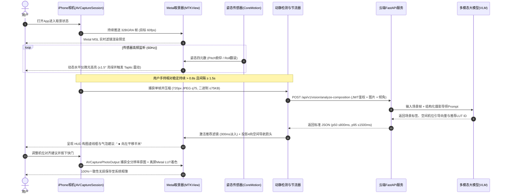

# AestheticLens-AI (AestheticLens) —— 系统技术架构与数据时序规范

| 文档版本 | v2.0.0 | 维护人 | 资深全栈工程师 / 架构师 |
| :--- | :--- | :--- | :--- |
| **所属终端** | Apple iPhone (iOS 原生) | 渲染核心 | Metal MSL + CoreMotion + CoreImage |
| **更新日期** | 2026-10-02 | 状态 | Design Freeze (设计冻结) |

本文档详述 **AestheticLens-AI (AestheticLens)** 针对 iPhone 客户端的底层核心架构设计，包括：
1. **iPhone 取景器与 Metal GPU 渲染管线**
2. **端云协同交互时序（Sequence Diagram）**
3. **性能防御与降级熔断策略**

---

## 一、 iPhone 取景器与 Metal 片元着色器管线 (Pipeline)

为了确保 60fps 满帧流畅取景（底线 24fps），且彻底杜绝 CPU 端的像素遍历与内存拷贝，整体视觉管线完全基于 iOS 原生硬件加速链路构建：

```text
[ 物理摄像头 AVCaptureSession (广角主摄) ]
                  │
                  │ (kCVPixelFormatType_32BGRA 帧缓存, 60fps)
                  ▼
       [ CVMetalTextureCache ]  <-- 零拷贝显存纹理映射 (时延 < 0.2ms)
                  │
                  ▼
       [ Metal 顶点着色器 (MSL) ]
                  │ (全屏四边形视口映射与方向矩阵适配)
                  ▼
       [ Metal 片元着色器 (MSL) ] ◄── [ 3D LUT 色卡纹理 (512x512 PNG, 8x8切片) ]
                  │ (切片内双线性采样 + 切片间线性插值，纳秒级色彩重映射)
                  ▼
              [ MTKView ]
        (取景器实时预览, 目标 60fps)
                  │
                  ▼
 [ AVCaptureVideoDataOutput 抽帧节流器 ]
   (防抖静止检测 >0.8s + 1.5s 周期节流, 降采样 720px JPEG q75, 二进制 ≤75KB)
                  │
                  ▼
  [ URLSession HTTP/2 异步上行至云端微服务 ]
```

### 3D LUT 色彩转换原理
* **标准色卡格式**：采用业界通用的 512×512 像素 2D 贴图表示 $64 \times 64 \times 64$ 的三维色彩立方体（Cube）。
* **插值算法规范**：采用**切片内双线性采样 + 切片间线性混合（等效三线性插值）**算法。
* 给定相机原始像素的颜色值 $(R, G, B)$：
  1. 将 $B$ 分量映射到 $0 \sim 63$ 的切片索引，通过取整得到低切片 `bLo` 与高切片 `bHi`，计算切片原点偏移量。
  2. 将 $(R, G)$ 分量映射为局部 UV 偏移量，并与切片基准坐标叠加。
  3. 分别在低切片与高切片采样后，按 $B$ 的小数部分进行线性混合，单像素计算耗时为纳秒级。

---

## 二、 端云协同数据交互时序图 (Sequence Diagram)



---

## 三、 性能防御与容灾降级机制 (Fault Tolerance)

| 异常场景 | 传统相机问题 | AestheticLens 容灾降级方案 (iPhone) |
| :--- | :--- | :--- |
| **网络完全断开 / 飞行模式** | 依赖云端大模型的应用直接崩溃报错 | 自动切入**离线兜底模式**：本地 60Hz CoreMotion 水平线、三分线与黄金螺旋网格正常工作，内置 4 套经典 LUT 滤镜支持离线手动切换。 |
| **云端时延剧增 (> 2.0s 超时)** | 取景器卡顿或转菊花等待 | **客户端 2.0s 超时强制熔断**：丢弃本次请求，不阻塞取景界面渲染，继续保持 60fps 预览，等待下一次手持稳定时再触发。 |
| **手机设备发热 (Thermal State 上升)** | 系统强制降频导致丢帧发烫 | **动态热降级保护**：当收到 iOS `ProcessInfo.thermalStateDidChangeNotification` 严重发热通知时，抽帧节流周期自动由 1.5s 延长至 3.5s，预览渲染临时降分辨率，保障设备散热。 |
| **高并发配额超限 (HTTP 429)** | 频繁请求导致账单爆炸 | 触发客户端滑动窗口本地限流拦截，暂停上行请求 15 秒，HUD 提示“网络繁忙，已切换至本地辅助构图”。 |
