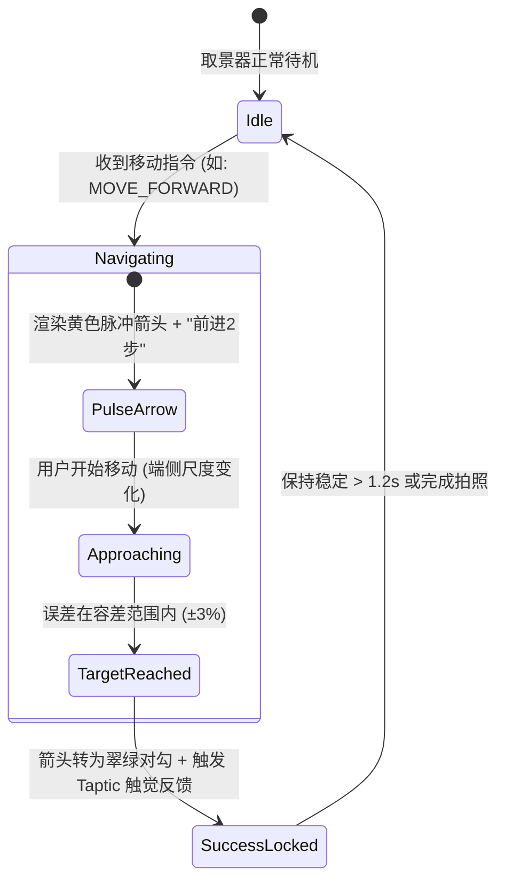
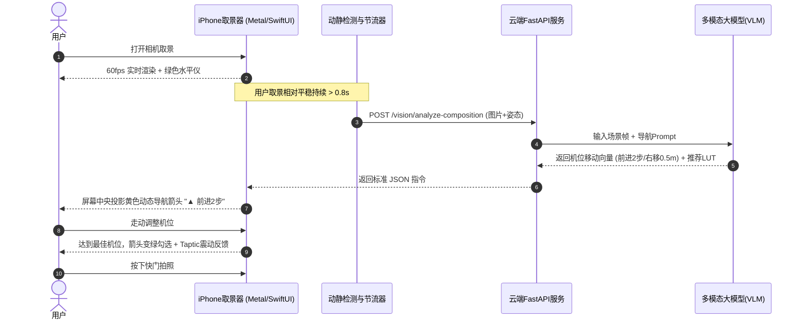
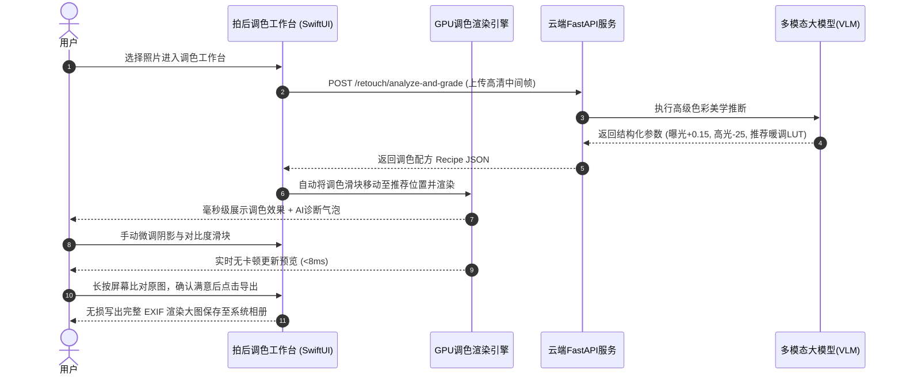

# AestheticLens-AI (灵瞳智拍) —— 系统技术设计文档 (TDD)

| 项目名称 | AestheticLens-AI (灵瞳智拍) | 文档版本 | v2.0.0 |
| :--- | :--- | :--- | :--- |
| **负责人** | 资深全栈工程师 / 系统架构师 | 目标终端 | Apple iPhone (iOS 原生) + FastAPI 云端微服务 |
| **文档定位** | 底层技术实现规范、算法数学模型、GPU渲染管线与端云数据流转 |

---

## 目录
1. [系统整体技术拓扑与全栈分层](#1-系统整体技术拓扑与全栈分层)
2. [拍摄中：空间 6-DoF 机位位姿导航与微调引导算法](#2-拍摄中空间-6-dof-机位位姿导航与微调引导算法)
3. [实时取景：Metal 3D LUT 片元着色与零拷贝管线](#3-实时取景metal-3d-lut-片元着色与零拷贝管线)
4. [拍后处理：AI 智能调色与专业参数微调工作台技术架构](#4-拍后处理ai-智能调色与专业参数微调工作台技术架构)
5. [云端微服务：多模态 VLM 双中台与 Prompt 决策工程](#5-云端微服务多模态-vlm-双中台与-prompt-决策工程)
6. [端云全链路交互时序图 (双场景时序)](#6-端云全链路交互时序图-双场景时序)
7. [非功能性保障：内存、功耗与容灾降级架构](#7-非功能性保障内存功耗与容灾降级架构)
8. [实机演示与高性价比部署上线实施规范 (选项 A)](#8-实机演示与高性价比部署上线实施规范-选项-a)

---

## 1. 系统整体技术拓扑与全栈分层

AestheticLens-AI 采用典型的“**强端侧低延迟交互 + 云端重推理异步决策**”的端云协同拓扑：

```mermaid
flowchart TB
    subgraph iOS_Client [iPhone 客户端 (SwiftUI + Metal + AVFoundation)]
        direction TB
        subgraph Capture_Subsystem [拍摄期子系统]
            AVSession[AVFoundation 摄像头流 32BGRA] --> CVTextureCache[CVMetalTextureCache]
            CVTextureCache --> MetalViewfinder[Metal 取景器: 3D LUT Shader 60fps]
            CoreMotion[CoreMotion 姿态传感器 60Hz] --> HorizonHUD[动态水平仪 HUD]
            VisionTracker[Vision 目标跟踪器 / 尺度估计] --> NavHUD[6-DoF 空间机位导航 HUD]
            AVSession --> CaptureThrottle[抽帧节流器 (防抖+1.5s周期)]
        end
        
        subgraph Post_Processing_Subsystem [拍后调色工作台子系统]
            PhotoPicker[相册选择 / 快门成片] --> CIRenderer[CoreImage / Metal 调色工作台]
            CIRenderer --> ToneControls[调色矩阵: 曝光/高光/色温/HSL/LUT]
            ToneControls --> FastPreview[实时滑块交互预览 (GPU 离屏)]
            ToneControls --> ExifSaver[全分辨率保留 EXIF 导出相册]
        end
    end

    subgraph Cloud_Backend [云端 AI 微服务 (FastAPI + Pydantic v2)]
        Gateway[FastAPI 异步路由网关]
        CaptureThrottle -->|POST /vision/analyze-composition| Gateway
        PhotoPicker -->|POST /retouch/analyze-and-grade| Gateway
        
        Gateway --> VLM_Router[多模态大模型智能路由]
        VLM_Router --> MLLM_Engine[多模态视觉大模型 (Qwen2-VL / Gemini 1.5 Flash)]
        MLLM_Engine --> StructuredParser[结构化 JSON 输出与参数归一化]
        
        StructuredParser -->|下发机位向量 + 推荐LUT| NavHUD
        StructuredParser -->|下发调色配方 Recipe JSON| ToneControls
    end
```

---

## 2. 拍摄中：空间 6-DoF 机位位姿导航与微调引导算法

### 2.1 算法决策逻辑（端云协同）
单纯依赖云端会导致网络延迟阻碍实时导航，单纯依赖本地则无法理解“美学构图意境”。因此设计**双轨驱动模型**：
1. **云端宏观语义诊断**：多模态大模型（VLM）每 1.5 秒分析一次画面全局语义（识别场景如“建筑纵深长廊”、“全身人像街拍”、“静物美食”），产出高阶构图策略（例如：`action: "low_angle_and_closer"`, `target_subject_ratio: 0.35`）。
2. **端侧多频异步几何追踪（CoreMotion 保持 60Hz + Vision 20~30Hz 人脸 / 5~10Hz 人体姿态采样 + HUD 侧插值平滑）**：
   * **Z 轴前后移动估算**：利用 iOS 原生 `Vision` 框架（人脸检测采用 `VNTrackFaceRectanglesRequest` 跑在 20~30Hz，复杂全身姿态采用 `VNDetectHumanBodyPoseRequest` 跑在 5~10Hz 并通过线性插值平滑输出），解算主体边界框面积占比 $S_{subject} = \frac{W_{box} \times H_{box}}{W_{screen} \times H_{screen}}$。
     * 当 $S_{subject} < S_{target} - 0.08$ 时，触发 `MOVE_FORWARD`（前进靠拢主体）。
     * 当 $S_{subject} > S_{target} + 0.12$ 时，触发 `MOVE_BACKWARD`（后退扩展景深）。
   * **X 轴左右平移估算**：结合画面边缘梯度分析与主体质心偏移量 $\Delta X = X_{center} - X_{rule\_of\_thirds}$。若偏移超过屏幕宽度的 $8\%$，触发 `MOVE_LEFT` 或 `MOVE_RIGHT`。
   * **Y 轴机位高低升降估算**：结合 CoreMotion 实时 60Hz 解算的俯仰角 $\theta_{pitch}$ 与云端目标角 $\theta_{target}$。若差值大于 $6^\circ$，触发 `MOVE_DOWN`（下蹲）或 `MOVE_UP`（举高）。

### 2.2 导航 HUD 状态机与交互设计
取景器 HUD 呈现 4 个方向的动态空间脉冲箭头（◄ ▲ ▼ ►），其状态流转如下：



---

## 3. 实时取景：Metal 3D LUT 片元着色与零拷贝管线

### 3.1 零拷贝显存纹理映射 (Zero-Copy Texture Pipeline)
在 iOS 上避免 CPU 与 GPU 之间来回搬运像素的关键机制：
* `AVCaptureVideoDataOutput` 采集格式指定为 `kCVPixelFormatType_32BGRA`。
* 使用 CoreVideo 提供的 `CVMetalTextureCacheCreateTextureFromImage` API，直接将摄像头输出的 `CVPixelBuffer` 映射为 Metal 的 `MTLTexture`，时延小于 **0.2 毫秒**。

### 3.2 3D LUT 片元采样数学算法 (等效三线性)
标准 3D LUT 将 RGB 空间划分为 $64 \times 64 \times 64$ 个网格节点，展开为 512×512 像素的 2D 贴图（水平 8 列 × 垂直 8 行，共 64 个切片，每个切片 $64 \times 64$ 像素）。
算法规范术语统一定义为：**切片内双线性采样 + 切片间线性混合（等效三线性插值）**。

在 Metal Shading Language (MSL) 片元着色器中的正确数学实现如下：

```metal
// 1. 蓝色通道索引映射 (含边界 clamp 保护，防 B=1.0 越界)
float blueIdx = clamp(baseColor.b * 63.0, 0.0, 63.0);
float bLo = floor(blueIdx);
float bFrac = blueIdx - bLo;
float bHi = min(bLo + 1.0, 63.0);

// 2. 计算 8x8 切片二维行列网格原点
float2 tileLo = float2(fmod(bLo, 8.0), floor(bLo / 8.0));
float2 tileHi = float2(fmod(bHi, 8.0), floor(bHi / 8.0));

// 3. 计算切片原点绝对偏移 + 像素中心 0.5 纹理偏移 (消除边缘漏色与下采样漂移)
// 注意：iOS Metal 纹理坐标原点位于左上角，PNG 贴图加载若有 V 轴翻转需在加载器中做规范化
float2 uvLo = (tileLo * 64.0 + clamp(baseColor.rg, 0.0, 1.0) * 63.0 + 0.5) / 512.0;
float2 uvHi = (tileHi * 64.0 + clamp(baseColor.rg, 0.0, 1.0) * 63.0 + 0.5) / 512.0;

// 4. 双切片采样并在 Z 轴方向进行线性插值混合 (等效三线性)
half3 colorLo = lutTexture.sample(s, uvLo).rgb;
half3 colorHi = lutTexture.sample(s, uvHi).rgb;
half3 gradedColor = mix(colorLo, colorHi, half(bFrac));

// 5. 根据滤镜强度参数与原始色彩进行线性过渡
half3 finalRgb = mix(baseColor.rgb, gradedColor, half(lutIntensity));
```

---

## 4. 拍后处理：AI 智能调色与专业参数微调工作台技术架构

### 4.1 调色算法数学模型 (Parametric Tone Pipeline)
调色工作台基于**非破坏性编辑模型（Non-Destructive Editing Pipeline）**，不直接覆盖原始图，而是通过实时参数树动态合成渲染：

```text
原始全分辨率像素 (Raw Input)
           │
           ▼
[ 1. 曝光调节 (Exposure) ] ──> C' = C * 2^(exposure)
           │
           ▼
[ 2. 对比度变换 (Contrast) ] ──> C' = (C - 0.5) * (1 + contrast) + 0.5
           │
           ▼
[ 3. 高光与阴影处理 (Highlights/Shadows) ] ──> S型分段压暗/提亮
           │
           ▼
[ 4. 色温与色调 (Temperature/Tint) ] ──> CIColorMatrix RGB 偏色修正
           │
           ▼
[ 5. 自然饱和度 (Vibrance) ] ──> 保护肤色，优先提升中低饱和度像素
           │
           ▼
[ 6. 3D LUT 色彩查找映射 ] ──> CIColorCubeWithColorSpace 电影级色彩重映射
           │
           ▼
[ 7. 细节与质感 (Vignette & Grain) ] ──> 径向渐变暗角 + 胶片噪点着色
           │
           ▼
最终高质量导出 (48MP JPEG / HEIC)
```

### 4.2 性能保证（全分辨率毫秒级滑动微调）
* 在用户拖动滑块时，界面渲染采用 **两级分辨率渲染策略（Dual-Resolution Cache）**：
  * **互动阶段（用户手指拖动滑块）**：以屏幕分辨率（约 1170×2532）进行实时渲染，每帧渲染时间 $< 8\text{ms}$，滑块极其丝滑。
  * **静止阶段（手指松开后 150ms）**：后台异步线程将完整参数矩阵提交给离屏 GPU 渲染全尺寸 48MP 大图并缓存，确保点击导出时秒级出片。
* **长按原图对比机制**：在 UI 上捕获 `LongPressGesture`，按下瞬间绕过滤镜链直接直通原始纹理，松手恢复，给用户强烈的成片视觉成就感。

---

## 5. 云端微服务：多模态 VLM 双中台与 Prompt 决策工程

云端微服务基于 **Python FastAPI + Pydantic v2** 架构，划分两个专用决策中台：

### 5.1 拍摄期中台：`POST /api/v1/vision/analyze-composition`
* **任务**：极速分析预览轻量帧（720px JPEG q75，二进制 ≤75KB），输出空间机位平移指令、取景框与实时滤镜。
* **Prompt 结构与边界约束**：
  ```markdown
  [Context]
  用户正在手持手机取景，当前传感器姿态为: Pitch = {pitch}°, Roll = {roll}°。
  [Instructions]
  1. 诊断取景器构图缺陷。如果主体过远，输出 "forward_steps"；若透视不平衡，输出水平平移米数。
  2. navigation_vector 取值必须严格限制在真实安全移动范围内（客户端仅作粗粒度动效呈现）：
     - forward_steps: 整数，范围 [1, 3]（仅允许 1~3 步提示）
     - horizontal_translation_m: 浮点数，绝对值 |horizontal_translation_m| ≤ 1.0（横向平移在 ±1.0m 以内）
     - vertical_translation_cm: 浮点数，绝对值 |vertical_translation_cm| ≤ 30.0（垂直微调在 ±30cm 以内）
  3. 匹配最协调的 3D LUT 滤镜，并输出简练有力的 coach_tip（必须 ≤ 20 字，动词开头）。
  4. 必须输出 100% 严格合法的纯 JSON 字符串，严禁携带 Markdown 代码块标记（```json）或任何闲聊文本。
  ```

* **云端 JSON 守卫与容灾兜底机制 (Fail-Safe Guard)**：
  1. **第一道·结构化约束**：通过 DashScope SDK 开启 JSON 格式化输出约束；
  2. **第二道·Pydantic v2 强校验与即时重试**：微服务接收到 VLM 输出后由 Pydantic 执行严格类型校验。若发生 JSON 解析畸变或字段缺损，服务端立即发起**快速重试 1 次**；
  3. **第三道·优雅降级 503 兜底**：若重试后仍然无法通过模型验证，服务端捕获异常并返回统一错误信封 `code: 50301 (多模态推理降级)`，指导客户端平滑保持本地 60fps 取景，绝不阻塞 UI 渲染或引发端侧 Crash。

### 5.2 拍后调色中台：`POST /api/v1/retouch/analyze-and-grade`
* **任务**：针对拍摄好的高清晰度成片（上传 1920px 缩放图），生成专业美学调色报告与完整的参数配方（Recipe）。
* **Prompt 结构**：
  ```markdown
  [Role]
  顶级电影调色师与商业摄影后期大师。
  [Instructions]
  分析输入照片的光比、色彩倾向与画面缺陷，给出：
  1. 一句精辟的美学调色诊断 (overall_critique)。
  2. 输出推荐目标风格 (如: 日落胶片、冷色赛博、王家卫风格)。
  3. 给出各调节项的具体数值: exposure (-1.0~1.0), highlights (-1.0~1.0), shadows (-1.0~1.0), temperature (-50~50), saturation (-1.0~1.0), recommended_lut_id。
  ```

---

## 6. 端云全链路交互时序图 (双场景时序)

### 场景一：拍摄中实时构图与机位导航时序


### 场景二：拍后照片进入 AI 调色工作台时序


---

## 7. 非功能性保障：内存、功耗与容灾降级架构

### 7.1 内存与显存控制红线 (Memory Guard)
* **大图分块与释放**：拍后全分辨率照片（48MP）在加载进内存时占用近 200MB 未压缩缓存，在离屏渲染处理完成后，必须立即调用 `autoreleasepool` 释放显存，严禁驻留常驻内存。
* **常驻内存控制**：iPhone App 取景状态常驻内存严格限制在 **$\le 150\text{ MB}$（极限红线 $250\text{ MB}$）**，调色工作台内存峰值严格控制在 **$\le 250\text{ MB}$（48MP 分块加载与释放）**，彻底杜绝 OOM 崩溃。

### 7.2 弱网与离线容灾熔断策略
1. **云端超时（$> 2.0\text{s}$）熔断**：放弃当前请求，继续保持本地 60Hz 水平仪与基础构图辅助线，右上角微标提示“本地离线模式”。
2. **离线调色自适应**：当无网络时，拍后调色工作台仍支持完整的本地 4 套常用 LUT 与全套参数滑块的手动微调，核心工具属性绝不因断网而瘫痪。

---

## 8. 实机演示与高性价比部署上线实施规范 (选项 A)

针对“个人自用 + 对外随时实机演示（免背电脑）”的核心业务场景，确定落地 **选项 A：Zeabur 轻量 PaaS + 阿里云 Qwen-VL + 个人真机直装** 的极低成本工业级流水线。详细操作手册见：[实机演示与极简部署上线指南.md](file:///F:/test1/1/AI%20camera/docs/%E6%8A%80%E6%9C%AF%E6%9E%B6%E6%9E%84/%E5%AE%9E%E6%9C%BA%E6%BC%94%E7%A4%BA%E4%B8%8E%E6%9E%81%E7%AE%80%E9%83%A8%E7%BD%B2%E4%B8%8A%E7%BA%BF%E6%8C%87%E5%8D%97.md)。

### 8.1 方案 A 技术拓扑与成本边界
* **云端微服务 (FastAPI)**：托管于 **Zeabur**（无冷启动延迟，免备案自动配置 Let's Encrypt 强加密 HTTPS 域名，按真实内存计费约 2~5 元/月）。
* **多模态大模型 (VLM)**：上游对接 **阿里云百炼 (DashScope) Qwen-VL-Plus**（国内直连网络往返 400~600ms，充值 10 元可支撑 1000+ 次真实构图与调色调用）。
* **客户端分发**：基于 **个人免费 Apple ID** 通过 Mac Xcode 编译直装真实 iPhone（0 元支出，配合 AltStore 局域网 Wi-Fi 后台无线自动刷新 7 天证书）。
* **总拥有成本 (TCO)**：首期仅需 **10 ~ 15 元**，即可拥有一套随时随地掏出手机对外演示的完整端云全栈闭环。

### 8.2 现场演示“防翻车”双保险机制 (Fail-Safe Switch)
为防止现场网络信号差、会场 Wi-Fi 屏蔽或上游模型抖动导致演示冷场，客户端架构层内建双数据源切换：
1. **在线真实链路 (Live Cloud)**：默认使用 Zeabur 生产公网 HTTPS 接口，进行真刀真枪的端云协同与大模型实时决策演示。
2. **隐藏离线调试链路 (Mock Fixtures Fallback)**：在设置页（SettingsView）中连续三击版本号激活隐藏 Debug 抽屉，一键切换为读取本地预置的 `docs/接口契约/mock数据桩/` 数据。离线模式跳过鉴权校验，毫秒级模拟返回夕阳人像、赛博夜景等黄金构图框与调色配方，确保在任何恶劣网络环境下汇报答辩 100% 顺畅。

---

## 9. 工程全生命周期流水线与摄影美学 Skill 演进工序

为了杜绝工序错位引发的返工，明确各阶段的严格依赖关系，全工程建立**“底座先行、评测探底、知识注入、端云闭环”**的工业级推进工序。

### 9.1 摄影美学专家 Skill 的架构定位与构成
本项目无需高成本、高延迟的模型微调（Fine-Tuning），而是通过构建轻量、高效的**摄影美学专家 Skill（知识工程中台）**来达成大师级推荐效果：
1. **物理先验注入器**：组装 iPhone CoreMotion 的实时姿态（Pitch/Roll）与相机等效焦距，让模型具备空间几何知觉；
2. **6 大场景黄金范例库 (Few-Shot Exemplars)**：基于 `docs/接口契约/mock数据桩/` 固化标准输入-输出样本，模型对标输出合法构图；
3. **动词提示词与安全边界护栏**：强制 `coach_tip ≤ 20字` 且动词开头；机位向量锁定在 `steps ∈ [1,3]`、`|h| ≤ 1.0m`、`|v| ≤ 30cm`；
4. **调色参数安全护栏 (Color Guard)**：自动修正高光阴影断层，保护肤色自然饱和度；
5. **JSON 守卫与即时重试**：Pydantic 校验畸变即时重试 1 次，失败走 503 兜底，杜绝客户端 Crash。

### 9.2 全生命周期 5 阶段 12 道工序时序链

```mermaid
flowchart TD
    subgraph S0 [阶段 0: 需求契约与设计冻结 (已完成)]
        P0[OpenAPI 3.1 契约 + 9套Mock桩 + 极简部署指南]
    end

    subgraph S1 [阶段 1: 端云工程骨架先行 (进行中)]
        T09[工序 1 (TO-09): FastAPI 云端脚手架<br>Pydantic模型 + JWT鉴权 + 滑动窗口限流 + 4条路由先返回Mock桩]
        T08[工序 2 (TO-08): iOS 客户端脚手架<br>SwiftUI + Metal MTKView + CoreMotion水平仪 + Debug菜单读Mock]
    end

    subgraph S2 [阶段 2: 评测选型与 Skill 大脑创建]
        T10_data[工序 3: 收集 20 张覆盖 6 大场景的真实测试集]
        T10_eval[工序 4 (TO-10): VLM POC 对比评测<br>qwen-vl-plus 实测延迟/合法率/探明模型盲区]
        Skill[工序 5 (🌟 Skill 创建): 固化 PhotographySkill 模块<br>姿态组装器 + Few-Shot模板 + 调色护栏 + 自动重试]
    end

    subgraph S3 [阶段 3: 真实 AI 串联与资产就绪 (W2~W4)]
        LUT[工序 6: 制作 4 套经典 3D LUT PNG 贴图入库]
        Connect[工序 7 (s3/s4): 服务端正式接入 Skill + 阿里云 API]
        ClientVision[工序 8 (c3/c4): 客户端接入 Metal 3D LUT + AR 虚线框]
    end

    subgraph S4 [阶段 4: 空间导航与调色工作台 (W5~W8)]
        Nav[工序 9 (REQ-11): 客户端 Vision 估算 + 4向导航黄色箭头]
        Capture[工序 10 (REQ-08): 快门离屏 Metal 渲染 48MP 大图保存]
        Studio[工序 11 (REQ-12): 拍后调色工作台双分辨率渲染与滑块微调]
    end

    subgraph S5 [阶段 5: 综合压测与整机上线 (W9~W11)]
        Test[工序 12: 端云联调性能压测 + 部署 Zeabur + AltStore无线续期真机演示]
    end

    P0 --> T09
    P0 --> T08
    T09 --> T10_data
    T10_data --> T10_eval
    T10_eval --> Skill
    Skill --> Connect
    T08 --> ClientVision
    LUT --> ClientVision
    Connect --> ClientVision
    ClientVision --> Nav
    Nav --> Capture
    Capture --> Studio
    Studio --> Test
```

### 9.3 为什么 Skill 必须安排在 TO-09/10 之后、s3 之前？
1. **先有骨架，后注入灵魂**：TO-09 搭建起 Pydantic 输入输出契约和测试框架后，编写的 Skill 代码有可挂载的载体与单测环境；
2. **先探底细，后写规则**：通过 TO-10 真实测试集评测，精准掌握大模型易错点，Skill 的 Prompt 约束才能弹无虚发；
3. **隔离保护，安全上线**：在工序 7 将微服务路由真正接入阿里云 API 之前，Skill 作为中间过滤层必须完全测试就绪，严防脏数据冲击客户端。


