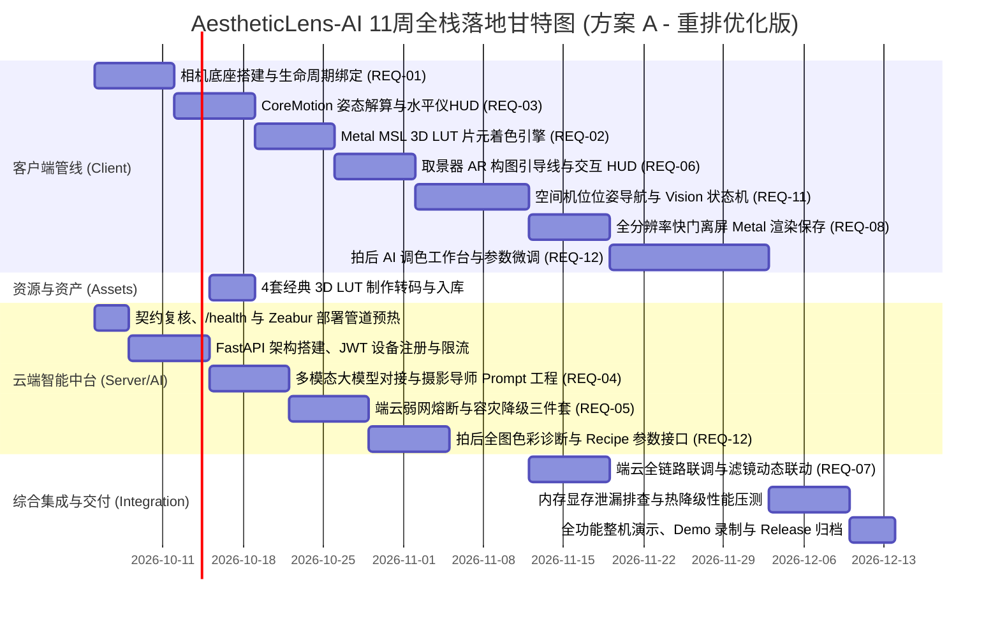

# AestheticLens-AI (AestheticLens) —— 需求开发规格说明书 (PRD & Tech Spec)

| 项目名称 | AestheticLens-AI (AestheticLens) | 文档版本 | v2.0.0 |
| :--- | :--- | :--- | :--- |
| **负责人** | 资深全栈工程师 / 架构师 | 开发周期 | 11 周 (方案 A 落地) |
| **项目形态** | iPhone 原生客户端 (SwiftUI + Metal + AVFoundation) + 云端 AI 微服务 (FastAPI) | 核心定位 | 端云协同的 AI 实时构图与智能调色相机 |

---

## 目录
1. [项目愿景与架构全景](#1-项目愿景与架构全景)
2. [重点需求矩阵 (带优先级高亮)](#2-重点需求矩阵-带优先级高亮)
3. [详细功能需求规格 (FR 规范)](#3-详细功能需求规格-fr-规范)
4. [非功能性需求与性能红线 (NFR 规范)](#4-非功能性需求与性能红线-nfr-规范)
5. [端云通信契约与 API 接口定义](#5-端云通信契约与-api-接口定义)
6. [大模型 Prompt 工程与结构化 JSON 规范](#6-大模型-prompt-工程与结构化-json-规范)
7. [敏捷冲刺实施路线图 (11 周方案 A)](#7-敏捷冲刺实施路线图-11-周方案-a)
8. [安全、限流、错误码与隐私合规](#8-安全限流错误码与隐私合规)
9. [附录 A：全局规范常量表](#附录-a全局规范常量表)
10. [附录 B：实机演示与部署上线实施架构 (选项 A)](#附录-b实机演示与部署上线实施架构-选项-a)

---

## 1. 项目愿景与架构全景

### 1.1 业务背景与用户痛点
* **痛点 1（拍不好）**：普通用户缺乏构图直觉，容易出现地平线倾斜、画面留白失衡、主体位置尴尬（拍人显矮、杂物穿头）。
* **痛点 2（调不来）**：拍摄现场光影千变万化，用户在繁杂的滤镜列表中盲目切换，难以快速找到匹配当前场景风格（如日系暖阳、复古胶片、赛博夜景）的最佳色彩预设。
* **解法**：打造一款能在取景器界面**实时感知场景、感知机位倾角、动态弹出专业构图线框/箭头指引，并秒级推荐并渲染最佳滤镜**的智能相机。

### 1.2 系统拓扑架构图 (iPhone 端云协同)

```mermaid
flowchart TD
    subgraph Client [iPhone 原生客户端 (SwiftUI + Metal + AVFoundation)]
        CamStream[AVFoundation 原始视频流 32BGRA] --> CVTexture[CVMetalTextureCache 零拷贝纹理]
        CVTexture --> ShaderEngine[Metal MSL 着色器: 3D LUT 片元渲染]
        ShaderEngine --> MTKView[取景器实时预览 1080P@60fps]
        
        CoreMotion[CoreMotion 陀螺仪与加速度 (60Hz)] --> LocalAttitude[姿态解算: Pitch俯仰 / Roll翻滚]
        LocalAttitude --> DynamicLevel[实时水平仪 / 倾角 HUD]
        
        CamStream --> KeyframeThrottler[智能抽帧节流器 (静止检测 / 1.5s 周期)]
        KeyframeThrottler -->|Base64 JPEG (<100KB) + 姿态元数据| CloudClient[URLSession 异步请求]
    end

    subgraph Backend [云端 AI 决策中台 (FastAPI 微服务)]
        CloudClient -->|HTTP/2 POST 抽帧分析| Gateway[API 路由网关]
        Gateway --> PydanticValidator[请求参数严格校验]
        PydanticValidator --> PromptBuilder[场景特征与 Prompt 构造引擎]
        PromptBuilder --> VLM_Engine[多模态大模型 VLM (Qwen2-VL / Gemini Flash)]
        VLM_Engine --> JsonExtractor[结构化 JSON 决策引擎]
        
        JsonExtractor -->|推荐滤镜ID + 构图几何框 + 拍摄建议| Gateway
    end

    Gateway -->|返回结构化指令| CloudClient
    CloudClient -->|更新 HUD 气泡与引导线| DynamicLevel
    CloudClient -->|热切预设色彩矩阵| ShaderEngine
```

---

## 2. 重点需求矩阵 (带优先级高亮)

> [!IMPORTANT]
> 需求按业界严苛标准划分为三大等级：
> * 🔴 **P0 (核心主链路 / 必须完成)**：构成全栈项目骨干，缺少任何一项均无法实现产品闭环。
> * 🟡 **P1 (关键增强项 / 体验跃升)**：大幅提升成片率与交互流畅度，是面试与实机演示的核心亮点。
> * 🟢 **P2 (扩展生态项 / 后续迭代)**：增强项目的工业完整度（资产热更与数据埋点）。

| 需求编号 | 需求名称 | 优先级 | 模块归属 | 核心价值与技术壁垒 |
| :--- | :--- | :---: | :---: | :--- |
| **REQ-01** | **原生相机管线接管与预览渲染** | 🔴 P0 | 客户端 | 稳定获取 60fps 实时预览流，实现生命周期安全绑定与前后置切换 |
| **REQ-02** | **GPU 加速的实时 3D LUT 滤镜引擎** | 🔴 P0 | 客户端 | 基于 Metal MSL Fragment Shader 毫秒级应用色彩查找表，严禁 CPU 逐像素处理 |
| **REQ-03** | **端侧低时延传感器姿态与水平解算** | 🔴 P0 | 客户端 | 60Hz 采样 CoreMotion 陀螺仪与加速度计，零网络依赖实时绘制动态水平校正仪 |
| **REQ-04** | **云端多模态大模型场景感知决策大脑** | 🔴 P0 | 服务端/AI | 深度解析取景画面光影、主体与透视，输出结构化构图指令与调色配置 |
| **REQ-05** | **智能抽帧与节流传输管道** | 🔴 P0 | 端云协同 | 客户端智能静止检测 + 1.5s 节流抽帧压缩，单次 Payload 控制在 100KB 以内 |
| **REQ-06** | **动态 AR 构图引导线与交互 HUD** | 🟡 P1 | 客户端 | 动态渲染三分线、黄金螺旋、透视引导框及机位微调气泡提示 |
| **REQ-07** | **智能调色参数与滤镜即时联动** | 🟡 P1 | 端云协同 | 接收云端决策后，无闪烁平滑过渡至推荐滤镜（带参数淡入动画） |
| **REQ-08** | **全分辨率快门捕获与渲染一致性** | 🟡 P1 | 客户端 | 快门拍照保存原始高分辨率图，且输出图片与预览取景器滤镜效果 100% 保持一致 |
| **REQ-09** | **滤镜预设与构图规则云端动态分发** | 🟢 P2 | 服务端 | 支持 LUT 文件（.png/.cube）热更新下载与本地 LRU 缓存 |
| **REQ-10** | **拍摄体验与采纳率数据埋点闭环** | 🟢 P2 | 全栈 | 记录用户是否采纳 AI 构图建议，为后期模型 Prompt 优化提供数据闭环 |
| **REQ-11** | **空间机位位姿导航与移动指引 (前后左右)** | 🔴 P0 | 端云协同 | 【新增】指导用户前后走动（变焦/近远景）、左右平移（平衡透视）及机位升降（俯仰），带空间动态箭头引导 |
| **REQ-12** | **拍后照片 AI 辅助调色与微调工作台** | 🔴 P0 | 端云/客户端 | 【新增】对拍摄完成的照片（或本地相册图）一键生成 AI 调色配方，自动下发 LUT 与曝光/色温/HSL 参数，提供可二次微调的工作台 |
| **REQ-13** | **成品视频 AI 调色与滤镜实时调试工作台** | 🔴 P0 | 全栈协同 | 【重大新增】支持导入/录制成品视频，多关键帧云端智能美学感知，Metal 60fps 实时播放着色调试（10维滑块+LUT），长按比对原片，硬件加速无损压制导出成片 |

---

## 3. 详细功能需求规格 (FR 规范)

### 🔴 P0-1: 实时原生相机流接管 (REQ-01)
* **功能描述**：App 启动即秒级进入取景状态，接管 iPhone 原生高分辨率相机传感器。
* **业务规则**：
  1. 采用 iOS 原生 **AVFoundation**（`AVCaptureSession`），绑定 `AVCaptureVideoDataOutput` 与 `AVCapturePhotoOutput` 两个独立用例。
  2. 格式输出设定为 `kCVPixelFormatType_32BGRA`，零拷贝直通 Metal 纹理缓存。
  3. 支持双指缩放（Pinch-to-zoom）、点击对焦与测光（Tap-to-focus）。
  4. 支持前置与后置摄像头无缝平滑切换，切换耗时不得超过 400ms。

### 🔴 P0-2: GPU 实时 3D LUT 滤镜渲染引擎 (REQ-02)
* **功能描述**：在取景器实时画面上施加专业电影级、胶片级色彩滤镜，帧率稳定在 60fps。
* **技术实现**：
  1. 预置 64×64×64 标准 3D LUT（以 512×512 的 2D 展开图形式加载为 Metal 2D 纹理）。
  2. 编写 **Metal Shading Language (MSL)** 片元着色器：
     * 输入纹理 0：Camera 实时预览纹理 (`CVMetalTextureCache` 绑定)。
     * 输入纹理 1：LUT 色卡纹理 (`texture2d<float, access::sample>`)。
     * 实时将每个像素的 RGB 作为三维坐标采样 LUT 纹理，完成非线性色彩重映射与三线性插值混合。
  3. 支持滤镜混合强度参数（`lutIntensity` 0.0 ~ 1.0 连续可调）。

### 🔴 P0-3: 本地低时延传感器姿态解算 (REQ-03)
* **功能描述**：无论网络状态好坏，手机物理倾角指示器必须毫秒级响应。
* **计算逻辑**：
  1. 监听 iOS 系统 **CoreMotion**（`CMMotionManager`），以 60Hz 采样姿态角。
  2. 参考系采用 `.xArbitraryCorrectedZVertical`，解算出高精度**翻滚角（Roll）**与**俯仰角（Pitch）**。
  3. 当 Roll 在 `[-1.5°, 1.5°]` 范围内时，判定为水平对准，水平仪颜色由淡白转为**翠绿高亮**并产生微触感震动反馈（`UIImpactFeedbackGenerator`）。

### 🔴 P0-4: 云端多模态大模型场景感知中台 (REQ-04)
* **功能描述**：接收客户端抽帧图片，解析场景特征并生成针对性的构图建议。
* **分析维度**：
  1. **场景分类**：人像（特写/全身/半身）、风景建筑、街拍、食物、夜景、逆光等。
  2. **构图评级与缺陷分析**：头顶留白过多、地平线不平、主体被遮挡、主体偏离重心。
  3. **动作建议（Guidance Action）**：
     * `low_angle`：放低机位仰拍（拉长腿部比例或强调建筑张力）。
     * `high_angle`：抬高机位俯拍。
     * `move_left` / `move_right`：水平微调机位。
     * `zoom_in` / `get_closer`：主体不够突出，建议靠近拍摄。
  4. **色彩滤镜推荐**：输出当前场景最适配的 `recommended_filter_id`。

### 🔴 P0-5: 边缘-云端低延迟抽帧与节流控制器 (REQ-05)
* **功能描述**：避免相机高频推流烧显存、消耗高昂大模型 API 费用与导致 iPhone 发烫。
* **触发机制（防抖策略）**：
  1. **动静检测算法**：通过手机加速度变化率（Jerk）判断用户当前是否在剧烈移动，**仅在手持相对静止持续 > 0.8 秒** 时触发单帧抓取。
  2. **最小间隔节流（Throttle）**：两次云端请求时间间隔不得小于 1.5 秒。
  3. **图像降采样**：上传前将 32BGRA/YUV 帧转为等比压缩 JPEG（长边限制在 720px，质量 75%），单包体积控制在 **60KB ~ 100KB**。

### 🟡 P1-1: 动态 AR 构图引导 HUD (REQ-06)
* **功能描述**：在取景器最上层覆盖一层硬件加速的透明绘制图层。
* **UI 组件**：
  1. **静态经典参考线**：支持手动开启三分线（九宫格）、黄金螺旋线、对角线透视。
  2. **动态建议框（AI Suggested Framing Box）**：当云端返回 `crop_box: [ymin, xmin, ymax, xmax]` 时，以平滑弹簧动画绘制出虚拟取景框，提示用户将主体对齐该框。
  3. **建议气泡（Coach Tip）**：以半透明胶囊样式悬浮于顶部，显示简洁有力的一句话指导（如：“蹲下一点仰拍，人物显修长”）。

### 🟡 P1-2: 智能调色参数与滤镜联动 (REQ-07)
* **功能描述**：云端返回推荐滤镜后，客户端具备“自动应用”与“推荐高亮”两种模式。
* **体验细节**：
  * 底部滤镜滑动滚轮中，被推荐的滤镜外圈增加发光呼吸灯边框。
  * 若开启“AI 自动调色”，着色器在 300ms 内通过 `alpha` 混合平滑过渡，杜绝突兀闪烁。

### 🟡 P1-3: 全分辨率快门捕获与渲染一致性 (REQ-08)
* **功能描述**：用户按下拍照按钮时，将当前预览的构图和滤镜无损固化至相册。
* **技术闭环**：
  1. 调用 `AVCapturePhotoOutput.capturePhoto(with:settings, delegate:self)` 获取 iPhone 传感器全分辨率原始数据（如 12MP / 48MP）。
  2. 离屏渲染（Offscreen Rendering）：在后台使用相同的 3D LUT Metal 着色器进行色彩映射。
  3. 写入 EXIF 拍摄参数并保存至系统相簿，保证“所见即所得”。

### 🔴 P0-6: 空间 6-DoF 机位位姿导航与前后左右移动指引 (REQ-11) 【新增核心】
* **功能描述**：不仅提示静态构图框，还能针对现实空间给出具体的**机位物理平移与前进后退指导**，引导用户移动手机至最佳拍摄视点（Optimal Viewpoint）。
* **多维移动决策维度**：
  1. **前后移动（Z轴 距离缩放）**：
     * `MOVE_FORWARD`（向前走 / 靠近主体）：当被摄主体（人脸/全身/特定物体）在画面占比过小（<15%）或背景杂乱时，提示“向前走两步，靠近主体增加特写张力”。
     * `MOVE_BACKWARD`（后退一步 / 扩大视野）：当主体边缘被切割、缺乏环境交代时，提示“后退一步，保留周围环境氛围”。
  2. **左右平移（X轴 视差与透视矫正）**：
     * `MOVE_LEFT` / `MOVE_RIGHT`：利用纵深透视线（如道路、长廊、对称建筑物），计算画面引导线交点；若偏离中心或三分线，以**动态半透明左右箭头**引导平移机位以达到完美透视或避开前景遮挡物。
  3. **高低升降（Y轴 俯仰与机位高度）**：
     * `MOVE_DOWN`（下蹲 / 低机位）：针对人像或宏伟建筑，结合负俯仰角提示“下蹲15cm仰拍，拉长腿部线条/增强视觉压迫感”。
     * `MOVE_UP`（举高机位 / 俯拍）：针对美食平铺（Flat Lay）或复杂人流背景，提示“双手举高俯拍，避开杂乱背景”。
* **交互呈现（视觉与动效）**：
  * 在取景器中央投影**脉冲式动态导航箭头（HUD Navigation Arrows: ◄ ▲ ▼ ►）**。
  * 配合距离与步数估算胶囊提示（如：“◄ 向左平移半米”，“▲ 前进2步”）。用户移动到位后，箭头变为翠绿勾选并伴随震动。

### 🔴 P0-7: 拍后照片 AI 辅助调色与专业参数微调工作台 (REQ-12) 【新增核心】
* **功能描述**：拍摄完成后，用户可点击相册进入拍后工作台，或直接从本地相册导入任意照片，享受**云端大模型诊断 + 一键智能美学调色 + 专业级滑块自由微调**的全流程体验。
* **业务流程与功能特性**：
  1. **AI 一键美学诊断（AI Smart Retouch）**：
     * 将全图上传至多模态大模型，深度分析照片的直方图动态范围、光比平衡、色彩倾向与风格氛围（如日系日落、冷调赛博、电影胶片、低调暗黑等）。
     * 输出结构化调色报告：包含画面缺陷评估（如“逆光暗部欠曝、天空色彩饱和不足”）与一键调色方案。
  2. **智能调色参数矩阵自动对齐**：
     * 自动装配最佳 3D LUT 色彩查找表（包含透明度滑块）。
     * 自动将以下基础与高阶参数初始化为 AI 推荐数值：
       * **曝光 (Exposure)**、**对比度 (Contrast)**、**高光抑制 (Highlights)**、**阴影提亮 (Shadows)**；
       * **色温 (Temperature)**、**色调 (Tint)**、**自然饱和度 (Vibrance)**；
       * **胶片颗粒 (Grain)**、**暗角 (Vignette)**。
  3. **专业微调交互工作台（Non-Destructive Editing Studio）**：
     * **实时 GPU 调色预览**：基于 iOS `CoreImage` / `Metal`，用户任意拖动滑块时，4800万高像素照片以毫秒级离屏响应，无任何卡顿。
     * **长按原图对比 (Before / After Comparison)**：在工作台长按任意区域瞬间切回原片，松开切回调色后，直观比对调色效果。
     * **无损导出与配方保存**：可将调色好的照片保存至系统相簿（保留完整 EXIF 信息），并支持将本次调色配方保存为“我的个性预设”。

---

### 🎨 附：界面线框布局设计 (UI Wireframes)

#### 1. 实时取景器界面 (含机位移动导航 HUD)
```text
+-------------------------------------------------------------+
|  [闪光灯]        [✨ 逆光夕阳: 前进两步并微蹲]        [设置/网格]  | <- 顶部 Coach 气泡
|                                                             |
|                          ▲ [前进2步]                         |
|                          │                                  |
|            - - - - - - - ┼ - - - - - - -                    |
|           |              │              |                   |
| ◄ [左移]  |   [ AI 推荐取景虚线框 ]      |  [右移] ►         | <- 空间移动引导箭头
|           |              │              |                   |
|           |       --- ( ┼ ) ---         |                   | <- 动态水平仪 (绿色准星)
|           |              │              |                   |
|            - - - - - - - ┼ - - - - - - -                    |
|                          │                                  |
|                          ▼ [下蹲15cm]                       |
|                      [ 1x | 2x ] 焦段切换                   |
+-------------------------------------------------------------+
|    (原图)   (🟡落日胶片)   (赛博夜景)   (日系微光)   (黑白经典) | <- 实时滤镜滚轮
+-------------------------------------------------------------+
|     [ 调色工作台 ]           [ ⚪ 快门 ]            [ 翻转镜头 ]| <- 底部操作区
+-------------------------------------------------------------+
```

#### 2. 拍后照片 AI 调色工作台界面 (Post-Processing Color Studio)
```text
+-------------------------------------------------------------+
|  [ 取消/返回 ]       [ 拍后 AI 调色工作台 ]          [ 导出成片 ]|
+-------------------------------------------------------------+
|                                                             |
|                                                             |
|                  [ 全分辨率照片预览区域 ]                    |
|               (长按此处随时比对调色前原图)                  |
|                                                             |
|                                                             |
+-------------------------------------------------------------+
|  [✨ AI 智能调色诊断报告] : "已压暗高光过曝，强化晚霞落日暖调" | <- AI 调色诊断说明
+-------------------------------------------------------------+
|  [滤镜]  落日余晖胶片 (强度 85%)   ━━━━━●━━━━  (微调滑块)    |
|  [曝光]  +0.15 EV                 ━━━━━●━━━━                |
|  [高光]  -25                      ━━●━━━━━━━                |
|  [色温]  +18 (偏暖)               ━━━━━━━●━━                |
|  [饱和]  +12                      ━━━━━━●━━━                |
+-------------------------------------------------------------+
|  [ 一键AI优化 ]   [ 滤镜库 ]   [ 光影调节 ]   [ 色彩HSL ]   | <- 底部功能标签栏
+-------------------------------------------------------------+
```

#### 3. 成品视频 AI 调色与滤镜调试工作台界面 (Video Color Studio)
```text
+-------------------------------------------------------------+
|  [ 取消/返回 ]       [ 成品视频 AI 调色调试台 ]       [ 导出视频 ]|
+-------------------------------------------------------------+
|                                                             |
|                                                             |
|                 [ 1080P 视频播放与实时色彩视窗 ]              |
|             (支持边播放边微调滑块，长按实时比对原片)         |
|                                                             |
|                                                             |
+-------------------------------------------------------------+
|  [ ▶ 播放 ]  00:04 / 00:15   ━━━●━━━━━━━━━━━━  [ 循环播放 ]  | <- 视频进度控制栏
+-------------------------------------------------------------+
|  [✨ AI 视频运镜与色彩诊断] : "镜头平移光比柔和，已强化青橙电影感" | <- AI 视频美学诊断
+-------------------------------------------------------------+
|  [滤镜]  赛博青橙 (强度 80%)       ━━━━━●━━━━  (实时预览)    |
|  [曝光]  +0.10 EV                 ━━━━━●━━━━                |
|  [对比]  +0.18                    ━━━━━━●━━━                |
|  [色温]  -8.0 (冷调夜景)          ━━━●━━━━━━                |
|  [暗角]  -0.12 (聚焦主体)          ━━●━━━━━━━                |
+-------------------------------------------------------------+
|  [ 基础光影 ]        [ 色彩科学 ]        [ 质感胶片 ]        | <- 滑块分类切换
+-------------------------------------------------------------+
```

### 🔴 P0-7: 成品视频 AI 辅助调色与滤镜实时调试工作台 (REQ-13)
* **功能描述**：打破仅支持静态照片的局限，深度赋能短视频创作，支持对本地导入或 App 录制的视频执行端云多帧感知、GPU 实时播放着色调试与硬件加速导出。
* **业务流程与技术规则**：
  1. **多关键帧智能抽帧（Multi-Keyframe Perception）**：
     - 用户选取视频后，客户端通过 `AVAssetImageGenerator` 在 50ms 内快速解耦出 3 张典型关键帧（0% 起始帧、50% 中间帧、85% 尾部高潮帧），压缩为 720px 图像包；
     - 携带视频基础元数据（时长、分辨率、帧率），发起 `POST /api/v1/retouch/analyze-video` 请求；
  2. **云端全片基准配方生成（Master Recipe）**：
     - 云端多模态大模型对 3 张关键帧进行色彩与光影全局感知，给出全片风格连贯性评价、最适配的 3D LUT 以及一组统摄全片的 10 维可逆滑块矩阵；
  3. **Metal 60fps 实时视频播放调色预览**：
     - 采用 `AVPlayer` + `AVPlayerItemVideoOutput` 管道获取视频原始像素缓冲区；
     - 逐帧送入 Metal 着色管线，以 60fps 满帧实时应用当前的 3D LUT 与 10 项滑块参数；
     - 支持播放/暂停、时间戳拖拽（Scrubbing）毫秒级预览；
     - 支持**长按视频画面实时 A/B 对比**（松手瞬间切回调色后，长按瞬间呈现无滤镜原片）；
  4. **硬件加速成片导出（Export Session）**：
     - 调色完成后，点击“导出视频”，基于 `AVAssetExportSession`（或 Metal 离屏像素渲染管道）将调色参数硬件加速烘焙入帧，导出为高质量 H.264/HEVC 格式并保存至系统相册。


---

## 4. 非功能性需求与性能红线 (NFR 规范)

> [!WARNING]
> 移动端实时图像处理对内存与热量极其敏感，开发过程中必须时刻守住以下核心红线（以附录 A 全局常量表为准）：

```text
+-----------------------+---------------------------------------+---------------------------------------+
| 指标项                | 达标要求 (Target)                     | 熔断红线 (Limit)                      |
+-----------------------+---------------------------------------+---------------------------------------+
| 取景器渲染帧率 (FPS)  | 目标 60 FPS 稳定运行                  | 任何情况不得低于 24 FPS (底线)        |
| 端云往返时延 (RTT)    | p50 ≤ 800ms                           | p95 ≤ 1500ms，超过 2.0s 强制熔断      |
| 客户端运行时内存占用  | 取景常驻 ≤ 150 MB                      | 极限红线 250 MB (防OOM)               |
| 拍后工作台内存峰值    | 峰值 ≤ 250 MB (48MP 分块加载与释放)    | 严禁突破 350 MB                       |
| 抽帧网络上行负载      | 二进制 ≤ 75 KB (Base64 编码后 ≤ 100 KB)| 单张上传 Base64 严禁超过 200 KB (413) |
+-----------------------+---------------------------------------+---------------------------------------+
```

1. **弱网容灾降级（Graceful Degradation）**：
   * 当云端单次请求超过 **2.0s** 或网络断开时，客户端立即放弃本次结果，自动切入**离线兜底模式**：保留本地 60Hz CoreMotion 水平线与内置 4 套经典 LUT 滤镜，右上角微标标记“离线辅助模式”。
2. **热量与功耗控制（Thermal Control）**：
   * 采用双线程解耦架构：取景与渲染管线运行于主线程与 Metal GPU 驱动管线，抽帧压缩、网络 I/O 运行于后台 Background 线程池。
   * **动态热降级保护**：当监听 iOS `ProcessInfo.thermalStateDidChangeNotification` 严重发热时，抽帧节流周期自动由 1.5s 延长至 3.5s，取景器适当降采样，连续取景 15 分钟手机背板温升控制在 4℃ 以内。

---

## 5. 端云通信契约与 API 接口定义

服务端基础路径：`https://api.aestheticlens.ai/api/v1`  
*(注：生产 Base URL 以附录 B Zeabur 分配域名 `https://aestheticlens-api.zeabur.app/api/v1` 为准，`api.aestheticlens.ai` 为自定义备用域名；本地联调与 Mock 调试环境为 `http://127.0.0.1:8000/api/v1`)*

### 5.1 场景感知与构图分析接口
* **Endpoint**：`POST /vision/analyze-composition`
* **Content-Type**：`application/json`

#### 请求参数 (Request Payload)
```json
{
  "client_version": "2.0.0",
  "device_info": {
    "platform": "ios",
    "focal_length_mm": 26.0,
    "sensor_attitude": {
      "pitch": -8.5,
      "roll": 1.2
    }
  },
  "image_meta": {
    "width": 720,
    "height": 960,
    "format": "jpeg"
  },
  "image_base64": "/9j/4AAQSkZJRgABAQAAAQABAAD..."
}
```

#### 响应参数 (Response Payload)
```json
{
  "code": 200,
  "message": "success",
  "data": {
    "request_id": "req_8f93e1a0d24c",
    "scene_analysis": {
      "scene_type": "portrait_sunset",
      "scene_label_zh": "逆光夕阳人像",
      "confidence": 0.94,
      "detected_issues": ["headroom_too_large", "horizon_tilted"]
    },
    "composition_guidance": {
      "coach_tip": "建议降低机位并前进两步，突出人物特写",
      "action_type": "low_angle_and_closer",
      "recommended_grid": "rule_of_thirds",
      "suggested_crop_box": {
        "ymin": 0.15,
        "xmin": 0.10,
        "ymax": 0.95,
        "xmax": 0.90
      },
      "target_pitch_adjustment_deg": 5.0,
      "navigation_vector": {
        "forward_steps": 2,
        "horizontal_translation_m": -0.5,
        "vertical_translation_cm": -15
      }
    },
    "filter_recommendation": {
      "recommended_lut_id": "lut_warm_film_03",
      "preset_name_zh": "落日余晖胶片",
      "recommended_intensity": 0.85,
      "color_adjustments": {
        "exposure": 0.05,
        "temperature": 12,
        "contrast": 0.1
      }
    }
  }
}
```

### 5.2 拍后照片 AI 美学诊断与参数推荐接口 【新增】
* **Endpoint**：`POST /retouch/analyze-and-grade`
* **Content-Type**：`application/json`

#### 请求参数 (Request Payload)
```json
{
  "client_version": "2.0.0",
  "photo_id": "photo_20261002_001",
  "image_meta": {
    "width": 1920,
    "height": 1440,
    "format": "jpeg"
  },
  "image_base64": "/9j/4AAQSkZJRgABAQAAAQABAA..."
}
```

#### 响应参数 (Response Payload)
```json
{
  "code": 200,
  "message": "success",
  "data": {
    "request_id": "retouch_99b2e04f",
    "aesthetic_diagnosis": {
      "overall_critique": "原片高光区域有轻度过曝，阴影部分色彩饱和偏低，整体层次略平淡。",
      "target_style": "warm_sunset_film",
      "style_name_zh": "落日暖调胶片"
    },
    "recommended_recipe": {
      "lut_id": "lut_warm_film_03",
      "lut_intensity": 0.85,
      "parameters": {
        "exposure": 0.15,
        "contrast": 0.12,
        "highlights": -0.25,
        "shadows": 0.10,
        "temperature": 18.0,
        "tint": -3.0,
        "vibrance": 0.14,
        "saturation": 0.08,
        "vignette": 0.15,
        "grain": 0.08
      }
    }
  }
}
```

### 5.3 滤镜资源元数据同步接口
* **Endpoint**：`GET /assets/filters`
* **Response**：返回全部可用滤镜列表（包含唯一标识 `lut_id`、色彩类别、缩略图 URL、512x512 LUT 资源下载直链与 MD5 校验和）。

---

## 6. 大模型 Prompt 工程与结构化 JSON 规范

云端大模型采用 **Structured Output（JSON 模式）**。系统提示词架构如下：

```markdown
[System Role]
你是一位精通摄影美学、视听语言与色彩学的资深摄影导师（Director of Photography）。
你将接收一张手机拍摄现场的低时延预览帧（连同手机当前物理倾斜角度）。
你的任务是快速诊断当前拍摄画面的构图缺陷，并给出清晰、可执行的指导与色彩建议。

[Output Constraints]
1. 严禁输出任何寒暄或 markdown 格式外的文本，必须返回 100% 合法的 JSON。
2. 建议语言（coach_tip）必须极度精炼（20字以内），用动词开头，例如“下蹲10厘米仰拍”、“向左移动两步突出道路透视”。
3. 必须输出规范的 `suggested_crop_box`（归一化坐标 0.0 ~ 1.0）。
4. 机位位姿移动向量（navigation_vector）必须限制在安全物理范围内：
   - forward_steps: 整数，仅限 [1, 3] 步；
   - horizontal_translation_m: 浮点数，绝对值 |horizontal_translation_m| ≤ 1.0 米；
   - vertical_translation_cm: 浮点数，绝对值 |vertical_translation_cm| ≤ 30.0 厘米。
```

> [!TIP]
> **服务端 JSON 守卫机制**：微服务网关层内置 Pydantic v2 强校验守卫。若模型首轮返回格式畸变，服务端即时触发快速自动重试 1 次；若仍不合法，服务端主动捕获并返回 `50301 (服务降级)` 信封，由客户端保持本地 60fps 取景，杜绝异常渗透或客户端崩溃。

---

## 7. 敏捷冲刺实施路线图 (11 周方案 A - 重排优化版)

### 7.0 全生命周期 5 阶段与 13 道工序推进法则
项目严格执行**“端云底座先行 → 前端UI/UX视觉原型评审 → 真实评测探底 → 摄影专家 Skill 知识固化 → 真实 AI 闭环 → 综合压测上线”**的 5 阶段 13 道严密工序：
1. **阶段 1 (底座骨架与视觉设计先行)**：
   - **工序 1 (后端骨架)**：TO-09（FastAPI 路由桩/Pydantic/JWT/限流）；
   - **工序 2 (端侧底座)**：TO-08（iOS 相机取景/Metal/水平仪/读Mock桩）；
   - **工序 3 (视觉设计先行 - 纠偏新增)**：**【UI/UX 高保真画面设计与交互原型评审 (Design Gate)】**。严禁在没有确定高保真视觉前盲目写代码，产出全套高保真 UI 效果图与在浏览器中可把玩的交互式 HTML 原型（涵盖 60fps 取景器 HUD、60Hz 绿色微光准星、金色 AR 虚线框、空间机位 4 向导航动态胶囊、以及拍后 10 滑块调色工作台），经评审确认后方可驱动客户端细节编码。
2. **阶段 2 (大脑铸造)**：收集 20 张评测集，执行 TO-10（VLM POC 对比），依据评测盲区**固化摄影美学专家 Skill 模块**（含姿态注入、Few-Shot 模板、动词约束、调色安全护栏、JSON 自动重试）；
3. **阶段 3 (AI 闭环与容器就绪)**：制作 4 套经典 LUT 贴图，云端 Docker 容器化与全中文 Swagger 工作台部署，微服务正式将路由对接 Skill + 阿里云 API，客户端接入 Metal 3D LUT 与 AR 框；
4. **阶段 4 (核心特性深度交互)**：实现 REQ-11 空间机位 4 向导航黄色动态箭头与 REQ-12 拍后调色双分辨率工作台 (`RetouchView.swift`)，支持长按对比原片与 10 个专业滑块微调；
5. **阶段 5 (压测交付)**：内存显存泄漏排查（≤150MB）、Zeabur 容器上线部署、免费 Apple ID 直装 + AltStore 续期演示验收。

甘特图排期严格消除未分配空档，服务端并行提前开工，新增 LUT 资产前置任务，综合集成无缝咬合：



### 7.1 里程碑与 REQ 覆盖映射表

| 里程碑 | 交付节点 | 交付物说明 | 覆盖 REQ 需求编号 |
| :--- | :--- | :--- | :--- |
| **M1** | 第 2 周末 (2026-10-18) | 跑通 iPhone 取景流，60Hz 采样 CoreMotion 实现微光绿色水平仪 HUD，倾角误差 $<0.5^\circ$ | **REQ-01, REQ-03** |
| **M2** | 第 4 周末 (2026-11-01) | Metal 零拷贝片元着色器实时跑通 3D LUT（4 套经典滤镜资产提前就位），叠加静态经典构图线（三分法/黄金螺旋） | **REQ-02, REQ-06** |
| **M3** | 第 6 周末 (2026-11-15) | 空间机位 4 向导航 HUD 与状态机联动；云端 VLM 摄影导师闭环；端云弱网熔断与降级三件套完成 | **REQ-04, REQ-05, REQ-11** |
| **M4** | 第 8 周末 (2026-11-29) | 全分辨率快门离屏渲染保存 (REQ-08)；拍后调色服务端 AI 美学诊断与 Recipe 配方接口闭环 | **REQ-08, REQ-12 (服务端接口)** |
| **M5** | 第 11 周 (2026-12-13/12-20) | 拍后调色工作台客户端完整版（双分辨率实时渲染、全套参数滑块微调、长按原图对比）；全链路整机性能压测全达标（60fps / 内存 ≤150MB / RTT ≤800ms），项目全量 12 个 REQ 交付归档（保留 12-14~12-20 为缓冲发布周） | **全量 12 个 REQ 交付** |

> [!NOTE]
> 范围调整说明：REQ-12 的「配方保存为我的个性预设」调整为 P1 优先级；REQ-09（滤镜云端热更）与 REQ-10（用户行为埋点）维持 P2 优先级，本期仅定义数据表与字段契约，不在 M5 阻断主干交付。

---

## 8. 安全、限流、错误码与隐私合规

### 8.1 设备注册与匿名 JWT 鉴权体系
为防止云端多模态 API 接口被脚本恶意盗刷，所有客户端在首次启动时必须向服务端完成匿名设备注册：
* **注册接口**：`POST /api/v1/auth/device-register`
  * 客户端上报 `device_id`（基于 iOS `identifierForVendor` 计算的 SHA256 哈希值）。
  * 服务端校验后匿名签发 **JWT (JSON Web Token)**，有效期为 30 天，支持平滑滚动续期。
* **接口安全约束**：
  * 所有的业务接口（`analyze-composition`、`analyze-and-grade`、`assets/filters`）必须在请求头中携带：
    `Authorization: Bearer <JWT>`
  * 缺少或非法 Token 直接返回 `401 UNAUTHORIZED`。

### 8.2 阶梯配额与滑动窗口限流机制
* **滑动窗口速率限制**：
  * 取景抽帧接口（`analyze-composition`）：单设备限流 **1 次 / 1.5 秒**；单设备日配额上限 **300 次 / 天**。
  * 拍后调色接口（`analyze-and-grade`）：单设备限流 **1 次 / 3 秒**；单设备日配额上限 **50 次 / 天**。
* **配额耗尽处理**：
  * 当设备超出单日配额时，服务端返回 `429 TOO_MANY_REQUESTS`，Header 携带 `Retry-After: 86400`。客户端接收后提示“今日 AI 额度已用完，已自动切入本地离线调色与构图辅助模式”。

### 8.3 载荷安全上限 (Payload Guard)
* **Body 严格限重**：
  * 针对 `analyze-composition` 接口，单次请求 JSON 体积上限为 **200 KB**。
  * 针对 `analyze-and-grade` 接口，单次请求 JSON 体积上限为 **2.5 MB**。
  * 任何超出上限的上传请求直接在网关层抛弃并返回 `413 PAYLOAD_TOO_LARGE`，保护云端微服务内存安全。

### 8.4 统一错误码规范表

服务端所有响应体统一使用标准外层信封包装：
```json
{
  "code": 200,
  "message": "success",
  "request_id": "req_8f93e1a0d24c",
  "data": null
}
```

| HTTP 状态码 | 业务错误代码 (code) | 错误场景描述 | 客户端处理行为 |
| :---: | :---: | :--- | :--- |
| **200** | 200 | 请求成功完成 | 正常消费 `data` 中的业务实体 |
| **400** | 40001 | 请求参数缺失或 Base64 格式无效 | 打印日志，丢弃本帧数据，不弹窗打扰用户 |
| **401** | 40101 | 缺少或非法的 Bearer JWT Token | 客户端自动静默调用 `/auth/device-register` 重新换票 |
| **413** | 41301 | 上传载荷超过安全阈值 (Payload Too Large) | 降低客户端 JPEG 压缩质量（q75 → q60）后重试 |
| **429** | 42901 | 触发滑动窗口限流或单日调用超额 | 降级切入本地模式，显示温和提示气泡 |
| **500** | 50001 | 云端微服务内部未捕获异常 | 客户端跳过该帧结果，记录错误日志 |
| **502** | 50201 | 上游多模态 VLM 推理超时或模型网关宕机 | 触发客户端快速重试 1 次，若仍失败则切入离线模式 |
| **503** | 50301 | 云端主动维护或熔断降级保护 | 客户端立刻隐退 AI 引导框，完全切入离线本地拍摄 |

### 8.5 隐私与数据安全合规 (Privacy & PIPL Compliance)
本项目高度重视用户视觉数据与肖像隐私，严格遵守 Apple App Store 审核准则（4.x）与个人信息保护法（PIPL）：
1. **图像内存生命周期与不落盘保证**：
   * 客户端上传的任何抽帧预览图与拍后成片，**仅在 VLM 推理的生命周期内驻留于服务端内存（RAM）**。
   * 推理完毕立即进行垃圾回收，**服务端严禁任何形式的持久化落盘存储（No Disk Persistence）、严禁写入数据库、严禁用于二次训练**。
   * 服务端日志系统（Loggers）严禁打印任何图片原始 Base64 字符串。
2. **生物特征非识别声明**：
   * 系统仅利用 Vision/VLM 估算构图几何轮廓（人像/物体的边界框坐标），**不做任何面部识别（Face ID）、不提取生物特征特征向量、不关联用户真实身份**。
3. **iOS 原生权限合规清单 (Info.plist)**：
   * `NSCameraUsageDescription`：需要访问您的摄像头以提供实时取景、AI 构图指导与胶片滤镜渲染。
   * `NSMotionUsageDescription`：需要访问运动传感器以实时解算拍摄角度与水平校正指示器。
   * `NSPhotoLibraryUsageDescription`：需要访问相册以支持在 AI 调色工作台中导入并编辑历史照片。
   * `NSPhotoLibraryAddUsageDescription`：需要保存经过 AI 构图与滤镜处理后的精美成片至系统相册。

---

## 附录 A：全局规范常量表 (Single Source of Truth)

为了杜绝跨文档与跨模块间的参数漂移，全工程统一以本表作为**唯一事实来源（SSOT）**：

| 参数项 | 标准常量定义 | 适用模块 | 业务与技术口径 |
| :--- | :--- | :--- | :--- |
| **抽帧长边尺寸** | `720 px` | 客户端 / 云端 | 等比缩放，长边严格限制在 720px |
| **抽帧压缩质量** | `JPEG q75` | 客户端 | 75% 有损压缩，兼顾细节保留与极低网络开销 |
| **抽帧单包体积** | **二进制 ≤ 75 KB** (Base64 后 ≤ 100 KB) | 网络上行 | 严格按此口径，单包网络带宽负荷极轻 |
| **单包体积熔断红线** | **Base64 严禁超过 200 KB** | 服务端网关 | 超过直接拦截并返回 `413 PAYLOAD_TOO_LARGE` |
| **抽帧防抖静止阈值** | `> 0.8 s` | 客户端节流器 | 手机加速度变化率（Jerk）趋于平稳超过 0.8s 触发单帧抓取 |
| **抽帧最小时间间隔** | `≥ 1.5 s` | 客户端节流器 | 两次云端分析请求之间的绝对最小冷却时间 |
| **云端超时熔断阈值** | `2.0 s` | 客户端 APIClient | 单次请求往返超过 2.0s 强制熔断丢弃，避免阻塞 UI 渲染 |
| **取景器运行帧率** | **目标 60 FPS** / 底线 24 FPS | Metal 渲染器 | 正常状态稳定 60fps 满帧运行，极端高温不得低于 24fps |
| **取景常驻内存** | **常驻 ≤ 150 MB** / 红线 250 MB | 客户端运行时 | Metal 纹理零拷贝复用，严禁显存泄漏引发 OOM |
| **工作台内存峰值** | **峰值 ≤ 250 MB** / 极限 350 MB | 拍后调色工作台 | 针对 4800 万像素照片采用分块离屏渲染，用完即释放 |
| **Coach Tip 字数限制**| `≤ 20 字` | 云端 Prompt / HUD | 必须动词开头、精炼有力，如“下蹲10厘米仰拍” |
| **Crop Box 数据结构** | **对象 `{ymin, xmin, ymax, xmax}`** | 端云传输契约 | 归一化浮点数（0.0 ~ 1.0），全链路禁止使用扁平数组 |
| **端云往返延迟 (RTT)** | **p50 ≤ 800 ms** / p95 ≤ 1500 ms | 全链路网络 | 包含端侧编码、网络往返与云端 VLM 推理全流程 |
| **动态热降级保护** | `1.5s -> 3.5s` | 客户端 ProcessInfo | 收到严重发热通知时，抽帧周期拉长至 3.5s 并调低渲染分辨率 |

---

## 附录 B：实机演示与部署上线实施架构 (选项 A)

针对产品“个人自用 + 对外随时实机演示（免背电脑、免搭建本地服务器）”的核心落地诉求，系统正式采纳**选项 A 极简部署架构**，并在需求层面明确以下落地规格与准入标准：

### B.1 整体架构与服务分工
1. **客户端层 (iOS Native)**：
   - 采用免费个人 Apple ID 进行开发签名，直接旁加载安装至 iPhone 真机；
   - 接入 **AltStore / SideStore** 局域网自动化无线重签名机制，彻底解决个人免费证书 7 天过期的痛点；
   - 具备开箱即用的离线能力，网络断开时不影响本地 60fps 取景、Metal 滤镜与水平仪解算。
2. **云端中台层 (PaaS 托管)**：
   - 选用 **Zeabur 轻量 PaaS 平台**托管 FastAPI 微服务容器，与 GitHub 仓库联动实现 CI/CD 提交即自动部署；
   - 启用 Zeabur 原生提供的免费 Let's Encrypt 泛域名 SSL 证书（`*.zeabur.app`），满足 iOS App Transport Security (ATS) 强制 HTTPS 加密通信要求，且免去国内域名 ICP 备案等待周期。
3. **视觉多模态大模型层 (VLM)**：
   - 接入**阿里云百炼平台（DashScope）**托管的 `qwen-vl-plus` 视觉推理模型，国内网络直连低延迟（往返约 400~600ms），按量计费，无需承担 GPU 宿主机闲置费用。

### B.2 成本控制与资源额度指标
* **固定服务器成本**：0 元（零物理机、零云主机年费）。
* **Apple 开发者年费**：0 元（免付 $99/年开发者账号）。
* **PaaS 运行时预算**：约 2 ~ 5 元 / 月（Zeabur 按 CPU/内存实际耗时计费，冷启动极快，夜间无请求几乎零开销）。
* **VLM 模型调用预算**：首次充值 10 元，单次推理约 0.008 ~ 0.01 元，可支撑 1000+ 次真实构图与色彩诊断实操演示。
* **总启动预算**：控制在 **10 ~ 15 元人民币**以内。

### B.3 演示防翻车双保险规范 (Debug 菜单需求)
为确保在电梯、地下车库、会场展厅弱网或模型网关突发拥堵等极端场景下实机演示绝对平稳，客户端必须内建 **Debug 隐藏调试面板**（在设置页版本号连续三击触发）：
1. **数据源模式一键切换**：
   - **云端实时推理 (Live API)**：连接 Zeabur 生产环境进行真实端云推演；
   - **本地仿真桩 (Local Mock)**：跳过鉴权网络请求，直接读取端侧预置的 `docs/接口契约/mock数据桩/` 数据（包含 `00_device_register.json`、6 大真实场景及拍后调色配方 JSON），无网环境下 100% 毫秒级展示完整 AR 虚线框与 4 向位姿导航动效。
2. **详细实操指引引用**：
   - 具体环境准备、Docker 构建、Xcode 配置与自检 Checklist 详见专项落地手册：[实机演示与极简部署上线指南.md](../技术架构/实机演示与极简部署上线指南.md) 以及技术设计规范 [系统技术设计文档.md](../技术架构/系统技术设计文档.md#第-8-章实机演示与高性价比部署上线实施规范-选项-a)。


